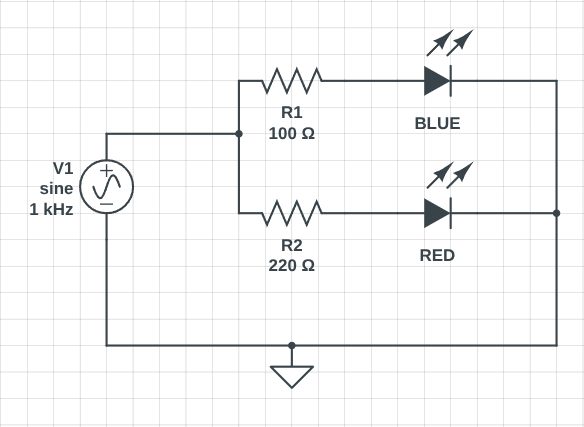

# Exercise 01 - Blink

## Basic GPIO control exercise - blinking an LED.

### Вимоги
- Використати два GPIO-виводи ESP32.
- Під’єднати червоний та синій світлодіоди через резистори.
- Реалізувати послідовність миготіння, у якій червоний і синій LED блимають по черзі.
- Програма має працювати циклічно.

### Додатково (необов’язково)
- ускладнити патерн миготіння
- додати третій світлодіод
- змінювати швидкість миготіння
- використати один GPIO-вивід ESP32.

