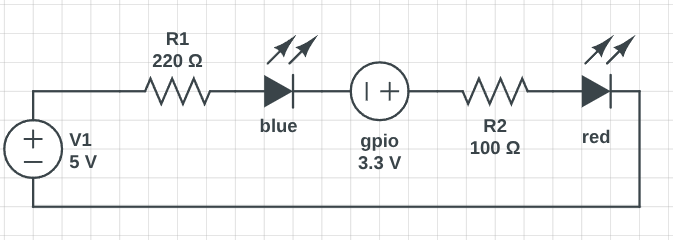

1. Завдання

    Під’єднати два світлодіоди до будь-яких вихідних GPIO ESP32.
    Під’єднати зовнішню кнопку до GPIO.
    Використати кнопку BOOT (GPIO0) як другу кнопку без додаткового підключення.
    Реалізувати два режими миготіння світлодіодів:
        режим, що активується зовнішньою кнопкою;
        режим, що активується кнопкою BOOT.
    При натисканні зовнішньої кнопки перемикати LEDs у швидший режим миготіння.
    При натисканні кнопки BOOT перемикати LEDs у повільніший режим миготіння.
    Миготіння реалізувати через delay().
    Усунути брязкіт контактів кнопок (затримка після спрацювання кнопки).*

2. Додаткове (опційно)

    Додати третій режим, який активується довгим натисканням кнопки або одночасним натисканням обох кнопок.
    Замість двох режимів реалізувати циклічне перемикання між трьома або більше швидкостями.
    Додати вивід у Serial Monitor із повідомленням про вибраний режим.

