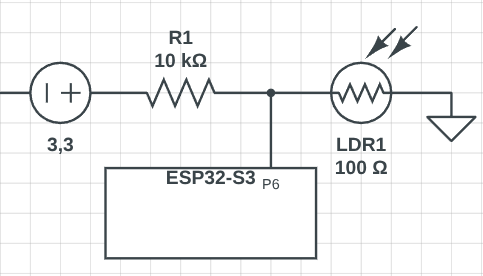

## Завдання:
- Підключити LDR до ESP32-S3 у вигляді подільника напруги.



- Зчитувати значення АЦП кожні 100 мс.
- Зчитати значення з АЦП за допомогою analogRead() (RAW data).
- Обчислити напругу за формулою:
```
Ucalc = Uref * RAW / ADCmax
```

- Зчитати напругу за допомогою analogReadMillivolts().
- Вивести в серійну консоль:
    - RAW значення АЦП
    - Обчислену напругу
    - Напругу, виміряну analogReadMillivolts()
- Порівняти обидва значення напруги та обчислити похибку.

## Результати:

│  #  │ RAW ADC  │  Calc V (mV)  │  Read V (mV)  │ Error % │
|-----|----------|---------------|---------------|---------|
│ 131 │   182    │    146.67     │       160     │   8.33  │
│ 132 │   233    │    187.77     │       204     │   7.96  │
│ 133 │   555    │    447.25     │       473     │   5.44  │
│ 134 │  1509    │   1216.04     │      1260     │   3.49  │
│ 135 │  1481    │   1193.48     │      1229     │   2.89  │
│ 136 │  1895    │   1527.11     │      1577     │   3.16  │
│ 137 │  1597    │   1286.96     │      1328     │   3.09  │
│ 138 │   236    │    190.18     │       202     │   5.85  │
│ 139 │   191    │    153.92     │       175     │  12.05  │
│ 140 │   583    │    469.82     │       505     │   6.97  │
│STATS| Avg Error: 5.63% |       | Max Error: 79.77% |     |