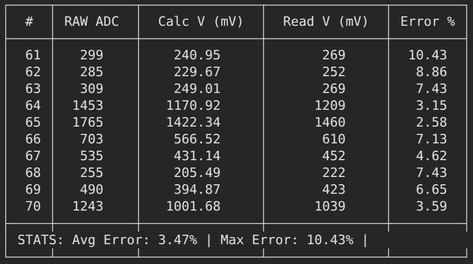

## Завдання:
- Підключити LDR до ESP32-S3 у вигляді подільника напруги.


- Зчитувати значення АЦП кожні 100 мс.
- Зчитати значення з АЦП за допомогою analogRead() (RAW data).
- Обчислити напругу за формулою:
```
Ucalc = Uref * RAW / ADCmax
```

- Зчитати напругу за допомогою analogReadMillivolts().
- Вивести в серійну консоль:
    - RAW значення АЦП
    - Обчислену напругу
    - Напругу, виміряну analogReadMillivolts()
- Порівняти обидва значення напруги та обчислити похибку.

## Результати:
